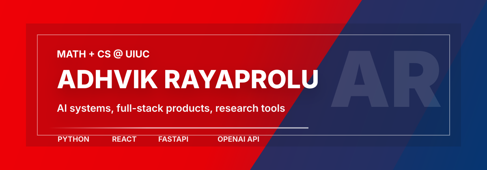

  

# Hi, I'm Adhvik.

I build software that turns practical ideas into useful tools. My work sits around full-stack applications, AI-assisted products, research-minded experimentation, and technology that helps people learn, connect, create, or make better decisions.

## What I Do

| Area | How I Think About It |
| --- | --- |
| Full-stack products | Build usable web and mobile experiences backed by reliable APIs and practical data flows. |
| AI-enabled tools | Explore where language models, document workflows, and human-centered automation can make software more useful. |
| Community technology | Design systems that help people organize around shared interests, learning, and collaboration. |
| Research-driven building | Treat projects as a way to ask better questions, test assumptions, and improve the next version. |

## Featured Work

| Project | What it is | Stack |
| --- | --- | --- |
| [Swave](https://github.com/adhvikrayaprolu/swave) | Music-focused app foundation with backend and frontend components. | TypeScript, Python |
| [UIUC Skillshare](https://github.com/adhvikrayaprolu/uiuc-skillshare) | Campus skill-sharing platform for learning and collaboration. | TypeScript |
| [GatherLink Web](https://github.com/adhvikrayaprolu/gather-link-web-app) | Interest-group management platform for communities. | Java, Spring Boot |
| [GatherLink Mobile](https://github.com/adhvikrayaprolu/gather-link-mobile-app) | Android companion for groups, posts, and user interactions. | Java, Android |
| [Chatbot App](https://github.com/adhvikrayaprolu/chatbot-app) | GPT-powered chatbot with document upload support. | Flask, HTML, OpenAI API |

## Toolkit

  
  
  
  
  
  

## What I'm Drawn To

I like building things where the engineering has a clear human purpose: tools for learning, creativity, access, collaboration, and better decision-making. I care about product feel, backend reliability, and the small choices that make technology easier to trust.

## Connect

- GitHub: [@adhvikrayaprolu](https://github.com/adhvikrayaprolu)
