<!-- Every section below is a hand-drawn SVG. Source + generator: scripts/sketch (npm run build). -->

  

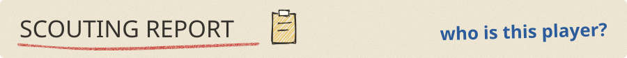
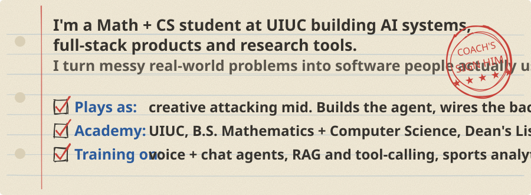

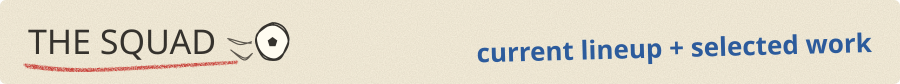

  <a href="https://astro.gnani.site/">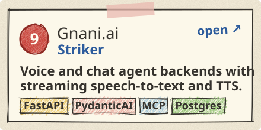</a>
  <a href="https://linkedin.com/in/adhvik-rayaprolu-9a214b327">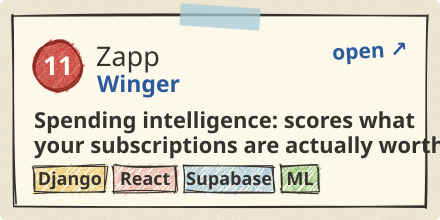</a>
  <a href="https://astro.gnani.site/">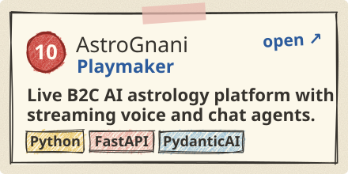</a>
  <a href="https://github.com/adhvikrayaprolu/iml_skillvsluck">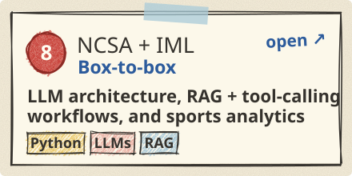</a>
  <a href="https://github.com/adhvikrayaprolu/chatbot-app">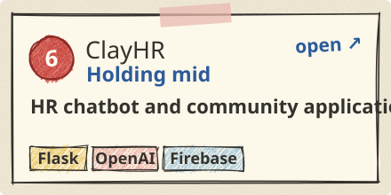</a>
  <a href="https://github.com/adhvikrayaprolu/iml_skillvsluck">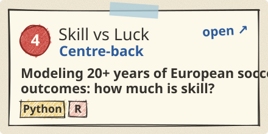</a>
  <a href="https://github.com/adhvikrayaprolu/chatbot-app">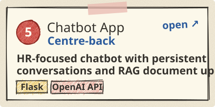</a>
  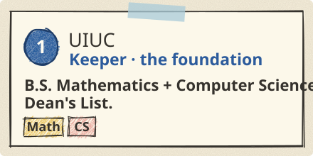

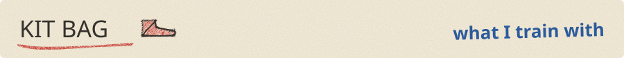
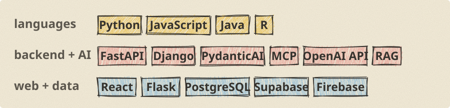

  <a href="https://linkedin.com/in/adhvik-rayaprolu-9a214b327">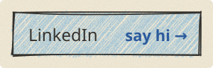</a>
  <a href="https://github.com/adhvikrayaprolu?tab=repositories">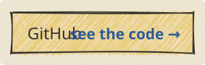</a>

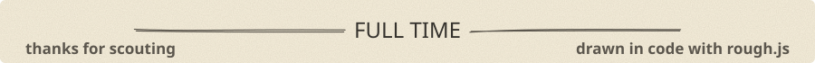
