<!-- Every section below is a hand-drawn SVG. Source + generator: scripts/sketch (npm run build). -->

  

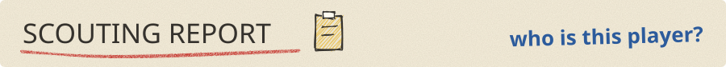
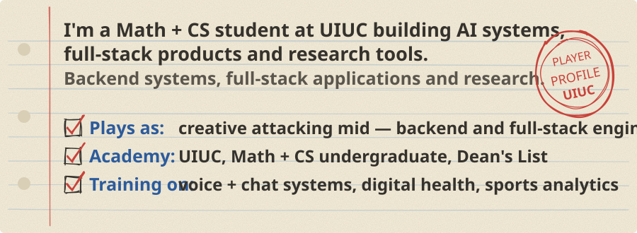

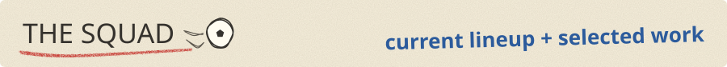

  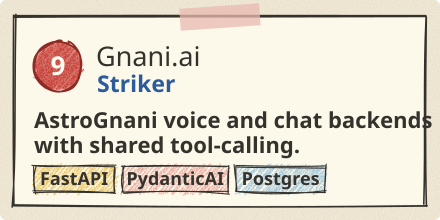
  <a href="https://github.com/adhvikrayaprolu/uiuc-skillshare">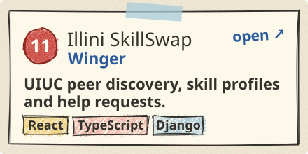</a>
  <a href="https://github.com/adhvikrayaprolu/swave">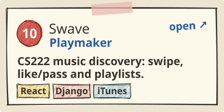</a>
  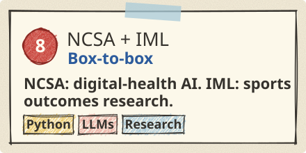
  <a href="https://github.com/adhvikrayaprolu/gather-link-web-app">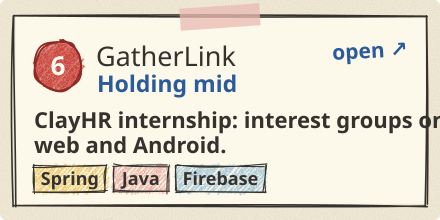</a>
  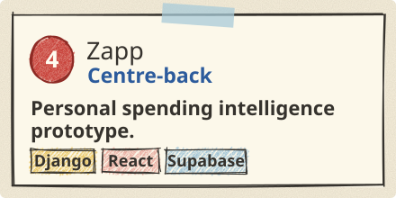
  <a href="https://github.com/adhvikrayaprolu/chatbot-app">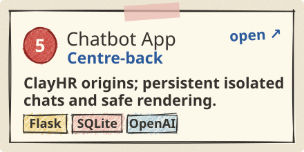</a>
  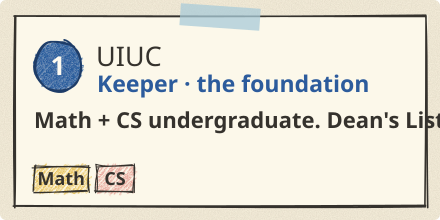

GatherLink: <a href="https://github.com/adhvikrayaprolu/gather-link-web-app">Web</a> · <a href="https://github.com/adhvikrayaprolu/gather-link-mobile-app">Android</a> — related ClayHR prototypes, separate data stores.

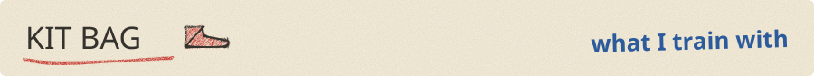
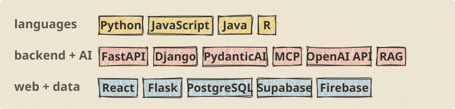

  <a href="https://linkedin.com/in/adhvik-rayaprolu-9a214b327">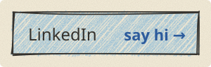</a>
  <a href="https://github.com/adhvikrayaprolu?tab=repositories">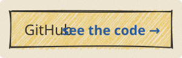</a>

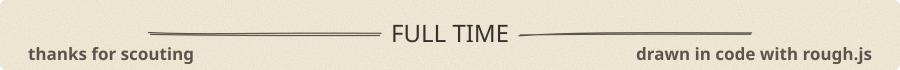
